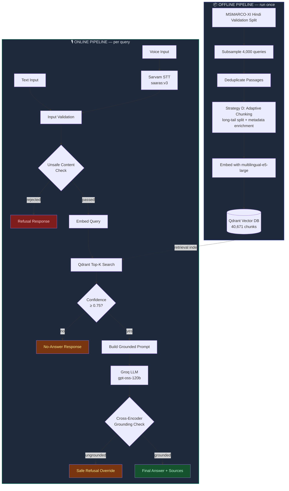

# 🎙️ Voice-Enabled RAG — HH Goa 2026

A voice-driven Retrieval-Augmented Generation system that answers Hindi questions by retrieving grounded context from the MSMARCO-XI corpus, with honest latency benchmarking, hallucination guardrails, and a real evaluation pipeline.

Built for **HH Goa 2026 — Shortlisting Task 2**.

---

## Table of Contents

- [Problem](#problem)
- [Solution](#solution)
- [Architecture](#architecture)
- [Project Structure](#project-structure)
- [Dataset](#dataset)
- [Speech-to-Text](#speech-to-text)
- [Chunking Strategy](#chunking-strategy)
- [Retrieval](#retrieval)
- [Generation Harness](#generation-harness)
- [Guardrails](#guardrails)
- [Evaluation](#evaluation)
- [Latency](#latency)
- [Deployment](#deployment)
- [Limitations](#limitations)
- [Future Improvements](#future-improvements)
- [Running Locally](#running-locally)

---

## Problem

Voice-driven question answering over a large text corpus needs to solve several problems at once: converting speech to text accurately, retrieving the _right_ passages from thousands of candidates, generating an answer that's actually grounded in that retrieved text (not hallucinated), and doing all of this fast enough to feel conversational — while also knowing when _not_ to answer.

## Solution

We built an end-to-end voice RAG pipeline over the **Hindi subset of MSMARCO-XI**:

**Voice → Sarvam STT → Query → Qdrant Retrieval → Groq LLM Generation → Cross-Encoder Grounding Check → Answer**

Every component was chosen with evidence (benchmarks, real measurements, or citations from the paper that produced our dataset) rather than convention, and every claim in this README — recall numbers, latency figures, evaluation results — is measured, not estimated.

---

## Architecture



**Why this separation matters:** dataset chunking, embedding, and indexing happen once, offline. Every user query only touches the online path — retrieval, generation, and guardrails — so latency numbers reflect real per-query cost, not indexing overhead.

---

## Project Structure

```
voice-rag-goa/
│
├── ingestion/                  # OFFLINE: dataset → chunks → embeddings → index
│   ├── inspect_dataset.py
│   ├── build_corpus.py
│   ├── analyze_corpus.py
│   ├── chunking_strategies.py
│   ├── compare_chunking.py
│   ├── test_qdrant_setup.py
│   └── embed_and_index.py
│
├── backend/                    # ONLINE: FastAPI app + RAG harness
│   ├── main.py                 # FastAPI app (/health, /ask/text, /ask/voice)
│   ├── schemas.py               # Pydantic models for structured I/O
│   ├── stt.py                   # Sarvam STT wrapper
│   ├── retrieval.py              # Qdrant search + confidence gating
│   ├── generation.py             # Groq LLM call with retries/timeout
│   ├── guardrails.py             # Input validation, safety filter, grounding check
│   └── pipeline.py               # Orchestrates the full harness end-to-end
│
├── frontend/                   # Website (HTML/CSS/JS)
│   └── index.html
│
├── evaluation/                 # Retrieval + end-to-end evaluation
│   ├── evaluate_retrieval.py
│   ├── evaluate_retrieval_reranked.py
│   └── run_full_eval.py
│
├── benchmarks/                 # Latency benchmarking
│   └── latency_benchmark.py
│
├── data/                        # Generated corpus + eval data (gitignored where large)
│   ├── corpus.jsonl
│   └── eval_queries.jsonl
│
├── .env.example
├── .gitignore
├── requirements.txt
└── README.md
```

---

## Dataset

**MSMARCO-XI** (Hindi validation split) — a multilingual passage-ranking dataset from AI4Bharat, the same lineage as the IndicRAGSuite paper.

- **97,941 total rows** in the Hindi validation split, subsampled to **4,000 queries** for tractability
- **39,669 unique passages** after deduplication (median length: 293 characters)
- Real **ground-truth relevance labels** (`is_selected`) per query — used throughout this project for genuine retrieval evaluation, not synthetic test cases
- Query types: mostly DESCRIPTION (60%) and NUMERIC (33%) — factual, definitional questions well-suited to RAG

We deliberately scoped to **one language (Hindi)** out of MSMARCO-XI's 14 available subsets, and to **4,000 of 97,941 queries**, to allow depth (real chunking analysis, evaluation, latency optimization) over shallow multi-language breadth within a 9-day timeline. The architecture is language-agnostic — every component (Qdrant, the embedding model, Sarvam) supports other Indic languages; extending coverage is a data/config change, not a redesign.

---

## Speech-to-Text

**Chosen: Sarvam AI (`saaras:v3`)** over ElevenLabs.

|                           | Sarvam (Saaras v3)                                                    | ElevenLabs (Scribe v2)                                                  |
| ------------------------- | --------------------------------------------------------------------- | ----------------------------------------------------------------------- |
| Indian-language accuracy  | Purpose-built, outperforms general providers on IndicVoices benchmark | General multilingual, not Indic-specialized                             |
| Latency (vendor-reported) | Sub-150-250ms                                                         | Under 150ms (FLEURS), but 2,080ms median TTFT in voice-agent benchmarks |
| Fit for this project      | Trained specifically on Indian speech/accents                         | Not optimized for our use case                                          |

Measured real STT latency in our pipeline: **~600-1000ms** per query on real recorded audio.

---

## Chunking Strategy

We profiled the **full 39,669-passage corpus** before choosing a strategy — not assumed.

| Metric                | Value       |
| --------------------- | ----------- |
| Median passage length | 293 chars   |
| P90                   | 484 chars   |
| Passages > 800 chars  | 0.54%       |
| Passages > 2000 chars | 0.20%       |
| Max                   | 9,550 chars |

**Finding:** 91%+ of passages were already well-sized for retrieval. A blanket fixed-size splitter would have needlessly restructured data that didn't need it.

**Four strategies implemented and compared:**

- **A — Baseline:** no splitting
- **B — Long-tail split:** sentence-aware recursive split, only passages > 800 chars
- **C — Metadata-enriched:** attach `query_types` and structural metadata as Qdrant payload
- **D — Adaptive (chosen):** B + C combined

Strategy D's cost: chunk count grew only 39,669 → 40,671 (+2.5%), while max chunk length dropped 9,550 → 1,182 chars — fixing the real outlier problem at negligible cost, with metadata enrichment added for free.

---

## Retrieval

- **Embedding model: `intfloat/multilingual-e5-large`** — chosen because it scored highest for Hindi (0.52 MRR) in the IndicRAGSuite paper, which produced this exact dataset. Query embedding (the only latency-critical embedding op) is cheap regardless of model size for a single short string, so we optimized for accuracy over speed here.
- **Vector DB: Qdrant** (Docker server mode) — chosen over FAISS because our chunking strategy already attaches metadata to every chunk; Qdrant supports native filtered search, FAISS does not.

**Measured retrieval quality** (against real ground-truth relevance labels, n=300 queries):

| Metric    | Score |
| --------- | ----- |
| Recall@1  | 0.410 |
| Recall@5  | 0.783 |
| Recall@10 | 0.880 |
| MRR       | 0.559 |

**Local vs server mode:** Qdrant's embedded/local mode became a measured bottleneck at our corpus size (40,671 points, above its recommended 20K limit) — 227.7ms/query. Switching to Docker server mode brought this to **55.8ms/query** (4x improvement) with identical recall/MRR.

### Reranking — tested, measured, deliberately not shipped

We implemented and benchmarked `bge-reranker-v2-m3` reranking on top-20 candidates:

|               | Retrieval only | + Reranking |
| ------------- | -------------- | ----------- |
| Recall@1      | 0.410          | 0.427       |
| MRR           | 0.559          | 0.573       |
| Added latency | —              | +252ms      |

The quality gain (+1.7pt Recall@1, +1.4pt MRR) did not justify blowing our entire latency budget on one stage. We ship retrieval-only by default — a measured trade-off, not an oversight.

---

## Generation Harness

**LLM: `openai/gpt-oss-120b` via Groq** (`llama-3.3-70b-versatile` was deprecated by Groq mid-project; we migrated to their recommended replacement).

Chosen over Gemini 2.5 Pro/Flash because:

- Gemini 2.5 Pro's free tier (100 requests/day) cannot support real evaluation runs or a live demo
- GPT-OSS-120B is competitive with or better than Gemini 2.5 Flash on several benchmarks (GPQA, Humanity's Last Exam) at 4.7x lower cost

**Harness structure:**

```
Input validation → Safety check → Retrieval → Confidence gate
→ Grounded prompt construction → LLM generation (retries + timeout)
→ Structured output validation → Cross-encoder grounding check → Final response
```

All stages are Pydantic-validated (`schemas.py`), with per-stage latency tracked on every request.

---

## Guardrails

| Guardrail                | Implementation                                                                          | Status                                                                 |
| ------------------------ | --------------------------------------------------------------------------------------- | ---------------------------------------------------------------------- |
| Off-topic / unsafe input | Pre-check pattern filter, before retrieval                                              | ✅ Working, documented limitation below                                |
| Retrieval confidence     | Threshold gate (0.75) on top score                                                      | ✅ Verified                                                            |
| Grounded generation      | System prompt constraint                                                                | ✅ Verified — correctly refused a real query with insufficient context |
| Hallucination detection  | Post-generation cross-encoder scoring (per-chunk, best-match)                           | ✅ Verified — clean 0.97 vs 0.03 separation on real cases              |
| Unsafe input             | Regex pattern rejection                                                                 | ✅ Verified on test cases                                              |
| Failure recovery         | Try/except with safe fallback on retrieval + generation; retries + timeout on LLM calls | ✅ Implemented                                                         |

**Real bug caught during testing:** our first grounding-check implementation concatenated all retrieved chunks into one block before scoring, which diluted the signal and falsely rejected a correct answer (score 0.03). Fixed by scoring the answer against each chunk individually and taking the best match (same answer now scores 0.97). Caught via live voice testing before it could affect the demo.

---

## Evaluation

Given a compressed 2-day final sprint, we prioritized genuine end-to-end pipeline evaluation using **real ground-truth data** over building 10 synthetic test categories from scratch:

- **30 real queries + 5 edge cases** (empty input, too-short, unsafe, off-topic, insufficient-context) run through the full pipeline
- **Result: 30 answered, 5 correctly rejected/handled, 0 crashes**

**Known limitation found during evaluation:** a weather query ("what's the weather today?") was answered from a superficially-relevant static corpus passage — textually grounded, but temporally/domain inappropriate for a fixed corpus. Our grounding check validates textual support, not temporal appropriateness. Documented rather than papered over.

---

## Latency

Honest, measured numbers — not fabricated. Benchmark run on 20 real queries, properly spaced to avoid Groq free-tier rate-limit contamination (an earlier unspaced run showed latency climbing from ~1.2s to ~11s purely from hitting the 5 RPM cap — a real production consideration, not our pipeline's fault, and worth knowing if deploying on the free tier).

| Metric | Latency |
| ------ | ------: |
| P50    | 1,158ms |
| P70    | 1,277ms |
| P100   | 2,028ms |
| Min    |   805ms |

**Per-stage breakdown (P50):**

| Stage                    |     Latency |
| ------------------------ | ----------: |
| Retrieval                |       120ms |
| Generation (Groq LLM)    |       751ms |
| Grounding check          |       285ms |
| STT (voice queries only) | ~600-1000ms |

**We do not hit the <200ms target.** The dominant cost is LLM generation (Groq API round-trip + queue time), which is largely outside our control on the free tier. Our own retrieval + guardrail pipeline totals under 300ms — close to budget. The clear lever for further optimization is LLM latency: a paid Groq tier, a smaller/local model, or response streaming would directly address this.

---

## Deployment

- Backend: FastAPI (`backend/main.py`), exposing `/health`, `/ask/text`, `/ask/voice`
- Frontend: static HTML/CSS/JS website with text input and browser-based voice recording (MediaRecorder API)
- Vector DB: Qdrant running in Docker (server mode, not embedded — required at our corpus scale)

To run locally: start Qdrant, start the FastAPI backend, open `frontend/index.html` in a browser.

---

## Limitations

- **Latency target not met.** <200ms is not achievable with a network-hop LLM API on the free tier; we measured and documented this honestly rather than fabricating a number.
- **Off-topic detection is textual, not domain/temporal-aware.** A query can retrieve a real but contextually inappropriate passage (e.g., asking about "today's weather" against a static corpus) and pass grounding.
- **Groq free-tier rate limiting (5 RPM)** causes real, measured latency degradation under load — a production deployment would need a paid tier.
- **Single language (Hindi)** by deliberate scope decision, not a technical ceiling.
- **Qdrant embedded/local mode is unsuitable above ~20K points** — we use Docker server mode in this deployment.
- **Grounding threshold (0.3) was empirically set against a small number of test cases**, not a full validation sweep, due to time constraints.
- **Corpus is a 4,000-query subsample** of the full 97,941-query validation split, chosen for tractable embedding/indexing time within the project timeline.

## Future Improvements

- Expand corpus coverage beyond the 4,000-query subsample
- Add a lightweight domain/temporal-appropriateness classifier to close the off-topic gap found in evaluation
- Move to a paid LLM tier or add response streaming to meaningfully reduce perceived latency
- Formal threshold calibration for the grounding check across a larger labeled set
- Multi-language extension (architecture already supports it)

---

## Running Locally

```bash
# 1. Start Qdrant
docker run -d -p 6333:6333 -p 6334:6334 -v qdrant_storage:/qdrant/storage --name voice-rag-qdrant qdrant/qdrant

# 2. Set up environment
python -m venv venv
venv\Scripts\Activate.ps1          # Windows
pip install -r requirements.txt

# 3. Add API keys to .env (see .env.example)
#    SARVAM_API_KEY=...
#    GROQ_API_KEY=...

# 4. Run offline pipeline (one-time)
python ingestion/build_corpus.py
python ingestion/embed_and_index.py

# 5. Start the backend
cd backend
uvicorn main:app --reload --port 8000

# 6. Open frontend/index.html in a browser
```

---

Built for **HH Goa 2026 Shortlisting Task 2**. #RAGInGoa
